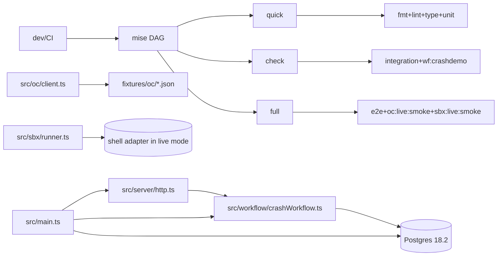

# ADR 000: Deterministic Workflow Harness Baseline

- Status: Accepted
- Date: 2026-02-17
- Inputs: `spec-0/00-learnings.jsonl` (12), `spec-0/01-tasks.jsonl` (18)
- Canonical scope: greenfield TS backend harness (`config|db|workflow|server|oc|sbx|lib`) with deterministic local/CI execution.
- Hard known gaps: OC live is contract-stub; SBX live is shell-adapter.

## Thesis (opinionated)

`Reliability is architecture, not retries.`  
Choose strict determinism + DB-backed truth + explicit task DAG. Reject "works on my machine" entropy.

## Decision Set (normative)

1. Orchestration DSL is `mise`, not ad-hoc shell DAG or npm scripts (`D02`,`D07`).
2. Runtime pins are contract, not suggestion: Node24 + PG18.2 (`D03`).
3. DB ops execute container-side (`docker compose exec psql`), never host dependency (`D04`).
4. Durability proof is DB-marker invariant `s1=1,s2=1`; logs are non-authoritative (`D06`).
5. Flake policy is source elimination (ban raw entropy APIs), not retry inflation (`D05`).
6. Soak/repeat checks force rerun (`mise run -f ...`) to defeat cache false-green (`D09`).
7. `MISE_TASK_OUTPUT=prefix` is pinned due to real runtime incompat in `line` mode (`D08`).
8. Modular seams are mandatory (`D01`), enabling replaceable engines/adapters.

## Architecture (current-state)



## Durability Model (why it is correct)

Invariant kernel:

- `app.workflow_runs(workflow_id PK)` => one durable run identity.
- `app.marks(run_id,step PK)` + `ON CONFLICT DO NOTHING` => exactly-once marker effects.
- phase derivation under `FOR UPDATE` lock => crash/restart safe transition.
- boot path calls `resumeIncomplete()` before serving => forward-progress after process death.

Crash-resume proof sketch:

```mermaid
sequenceDiagram
  autonumber
  participant C as Client
  participant P1 as Proc-1
  participant DB as Postgres
  participant P2 as Proc-2

  C->>P1: POST /crashdemo?wf=X
  P1->>DB: INSERT workflow_runs(X) ON CONFLICT DO NOTHING
  P1->>DB: tx(FOR UPDATE) -> mark s1 once
  P1--xP1: kill -9
  P2->>DB: resumeIncomplete()
  P2->>DB: mark s2 once; set completed=true
  C->>DB: SELECT marks WHERE run_id=X
  DB-->>C: {s1:1,s2:1}
```

## Rejected Paths (hard no)

- Primary `npm|pnpm run` orchestration: duplicates DAG truth; drifts from CI.
- Log-scrape correctness checks: non-deterministic, noisy, non-machine-proof.
- In-memory business truth: lost on crash/redeploy; violates durability contract.
- Allow raw `Math.random|Date.now|new Date|hrtime|randomUUID`: direct flake injector.
- Hidden shell orchestration inside tasks: invisible deps, brittle parallelism.

## Walkthroughs (compressed)

1. Fast local gate:

```bash
mise install
mise run quick
```

Expectation: deterministic unit suite (frozen clock, seeded RNG, net deny except localhost).

2. Core correctness gate:

```bash
mise run check
```

Expectation: `quick + integration(mock DB) + wf:crashdemo` with explicit DAG fanout.

3. Durability stress (real reruns):

```bash
mise run -f wf:crashdemo
mise run wf:crashdemo:soak
```

Expectation: every loop executes real crash/restart, no cache elision, markers settle `1/1`.

4. Idempotency assertion query:

```sql
SELECT step, COUNT(*) FROM app.marks WHERE run_id=$1 GROUP BY step;
-- must be s1=1,s2=1
```

5. OC replay determinism key:

```ts
key = sha256(canonical({ intent, schemaVersion, seed }));
```

Effect: stable fixture addressing; schema-validated payload gate.

6. SBX deterministic artifact ordering:

```ts
files = Object.fromEntries(Object.entries(files).sort());
```

Effect: output canonicalization across runs.

## Coverage Ledger (completeness)

Legend: `A=accepted/live`, `G=gap/known constraint`, `N=next`.

### Learnings (`D*`,`C*`)

| ID  | State | Encoded as                                                                              |
| --- | ----- | --------------------------------------------------------------------------------------- |
| D01 | A     | module seams + typed boundaries (`src/*` split)                                         |
| D02 | A     | `mise` as sole orchestration surface (`mise.toml`, CI)                                  |
| D03 | A     | Node24/PG18.2 pins (`mise.toml`,`docker-compose.yml`)                                   |
| D04 | A     | container-side DB scripts (`scripts/db/*.sh`)                                           |
| D05 | A     | lint entropy ban + deterministic test harness (`scripts/lint-flake.sh`,`test/setup.ts`) |
| D06 | A     | DB marker assertion (`scripts/assert-marks.ts`,`wf-crashdemo.sh`)                       |
| D07 | A     | explicit `check=quick+integration+wf` DAG                                               |
| D08 | A     | `MISE_TASK_OUTPUT=prefix` env pin                                                       |
| D09 | A     | soak uses `mise run -f wf:crashdemo`                                                    |
| C01 | A     | DBOS SDK integrated and authoritative (v4.8.8)                                          |
| C02 | G     | OC live smoke is contract-stub (no real provider creds/endpoint)                        |
| C03 | G     | SBX live smoke is shell adapter (no microVM integration)                                |

### Tasks (`T*`)

| ID   | State | Outcome                                             |
| ---- | ----- | --------------------------------------------------- |
| T001 | done  | repo/tooling bootstrap                              |
| T002 | done  | deterministic mise env baseline                     |
| T003 | done  | namespace+gradient task DAG                         |
| T004 | done  | incremental `sources/outputs` gates                 |
| T005 | done  | determinism harness (time/random/net + lint policy) |
| T006 | done  | disposable PG18.2 harness + DB lifecycle tasks      |
| T007 | done  | crash-resume workflow demo + marker assertion       |
| T008 | done  | workflow idempotency integration proof              |
| T009 | done  | OC replay/record/live contract pipeline             |
| T010 | done  | SBX mock/live split + stable artifact ordering      |
| T011 | done  | CI parity through `mise run ci:*`                   |
| T012 | done  | parallel stress at `MISE_JOBS=8`                    |
| T013 | done  | durability soak loop                                |
| T014 | done  | output-mode panic regression fixed                  |
| T015 | done  | soak cache false-positive regression fixed          |
| T016 | done  | migrate custom workflow engine -> DBOS SDK APIs     |
| T017 | todo  | wire real OC live provider + drift checks           |
| T018 | todo  | wire real SBX microVM live smoke                    |

## Consequences

Positive:

- High replayability and CI-local parity.
- Crash correctness has machine-verifiable DB oracle.
- Module seams allow later DBOS/real-provider swap with contained blast radius.

Tradeoffs:

- More upfront policy/discipline cost.
- Live smokes are partially synthetic until providers are truly integrated.
- Strict determinism forbids convenience APIs outside wrappers.

## Next ADR Triggers

Create follow-up ADRs when any of these flips:

1. `T016`: DBOS runtime integration changes workflow API/semantics.
2. `T017`: OC live provider introduces non-deterministic drift classes.
3. `T018`: microVM runner changes artifact model, timeout/retry policy, or cost envelope.

## Pointers

- Companion walkthroughs: `docs/adr/000-deterministic-workflow-harness/walkthroughs.md`
- Companion diagrams: `docs/adr/000-deterministic-workflow-harness/diagrams.mmd`
- Companion commands: `docs/adr/000-deterministic-workflow-harness/snippets.sh`
