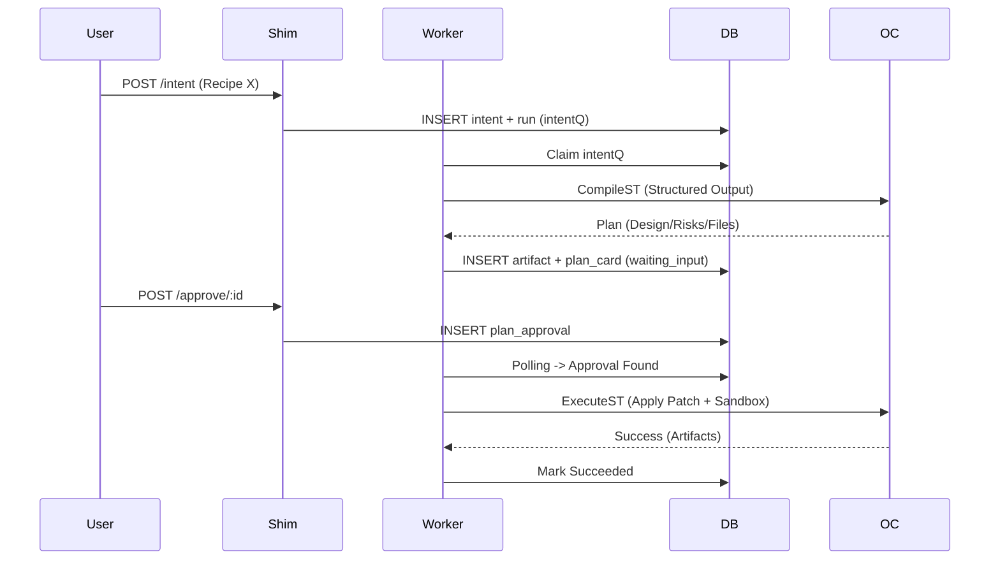

# ADR 004: Durable OC Hardening & Closure

## Status

Accepted | 2026-02-18 | Final Cycle 5 Mastery

## Context

Finish "Cycle 2" (MP20..MP23+BetE) under strict DBOS split topology. Goal: zero-leak OpenCode (OC) integration with durable exactly-once proofs and fail-closed security.

## Decisions

### 1. Exactly-Once Ledger (L85)

- **Constraint**: `opencode_calls.op_key` promoted to `UNIQUE`.
- **Mechanism**: `INSERT ... ON CONFLICT(op_key) DO NOTHING` + read-through by `op_key`.
- **Result**: Provider double-billing impossible; replay oracle is pure SQL. Cross-process retry identity is stable.

### 2. Fail-Closed Boundary Lattice (L86, M05)

- **Rule**: Zero `as` casts in `src/oc/**`, `src/workflow/**`, or `src/server/**` ingress/egress.
- **Enforcement**: Ajv-backed `assert*` guards at every hop (Ingress -> DB Load -> Step Output -> Egress).
- **Result**: Invalid payloads return deterministic 400s; type safety is verified, not claimed.

### 3. Plan/Build Gate Split (H13, H24)

- **Arch**: `CompileST` (Structured) -> `Plan Approval` -> `ExecuteST` (Sandbox).
- **Control**: Build blocked until `plan_approvals` row exists for `intent_id`.
- **Flow**: Agent switching (Plan-Agent vs Build-Agent) occurs within single session via wrapper-level identity swap.

### 4. Runtime Hardening (BetE, C5)

- **Child-Session Ban**: Static regex policy + runtime wrapper assert forbidding `parentSessionId`. Prevents recursive costs/loops.
- **Stall Detector**: Event/Toolcall heartbeat. Fail-fast diagnostics if idle > N sec.
- **Timeout Policy**: Revert last turn -> Shrink scope (re-prompt) -> Terminal `oc_timeout` failure. No half-applied state.

### 5. Determinism & Integrity (L91, L92)

- **Artifacts**: Replace placeholders with real SHA-256 hex digests.
- **RNG**: `RANDOM_SEED` env-var support for process-boot `randomSeed` initialization.
- **Result**: Identical inputs + seed = bit-perfect trace replay.

## Walkthrough: Intent-to-Succeed Cycle



## Snippets

### Ledger Exactly-Once

```typescript
// src/oc/wrapper.ts
const opKey = hash([sessionId, stepId, attempt]);
const existing = await repo.getByOpKey(opKey);
if (existing) return existing.payload; // SQL-level idempotency

const res = await sdk.call(args);
await repo.insert({ op_key: opKey, payload: res }); // ON CONFLICT DO NOTHING
```

### Stall Heartbeat

```typescript
// src/oc/stall-detector.ts
export class StallDetector {
  constructor(private timeoutMs: number) {}
  heartbeat() {
    this.last = Date.now();
  }
  check() {
    if (Date.now() - this.last > this.timeoutMs) throw new StallError();
  }
}
```

## Verification Oracle (G5, G8)

- `mise run check`: Full DAG validation (lint -> policy -> unit -> integration).
- `mise run test:e2e`: Intent -> Approve -> Success golden trace.
- `mise run policy:no-parentid`: Static ban on recursive sessions.
- `mise run -f oc:daemon:contract`: Real/Mock provider contract signoff.

## Consequences

- **Positive**: Zero billing flakes; deterministic replay; audit-ready artifacts; fail-closed daemon contract.
- **Negative**: Compile latency increase (structured schema); approval latency (build gate); no ad-hoc process.env access.
- **Closure**: Post-C5 audit (R24-R28) resolved `mise` cache-skipped daemon/integration flakes via `-f` and `OC_STRICT_MODE=1`. All G0..G8 gates green.

## Final Summary (Mastery)

The OC-C5 closure marks the transition from "vague integration" to "durable control plane." Every provider call is ledger-backed, every artifact is SHA-verifiable, and every workflow turn is fail-closed. No `as` casts, no recursive sessions, no silent daemon fallbacks.
