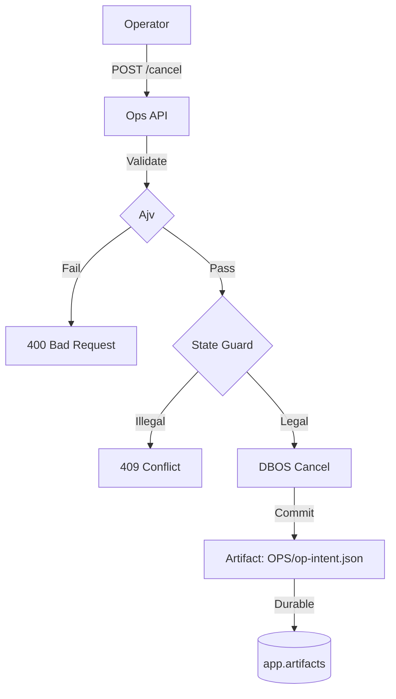

# ADR 007: Durable Ops Control & Proof Mastery

**Status:** Accepted / Released (2026-02-20)
**Cycle:** Cycle 7 (C5/C7 Release)
**Objective:** Replace log-based ops with deterministic SQL-backed control plane.
**North:** `contract > det/fail-closed > SQL-xonce > throughput/ergonomics`.

## 1. The 6-Route Control Surface

Discard ad-hoc routes. Standardize on `/api/ops/wf*` with strict Ajv contracts (`additionalProperties: false`).

| Route | Verb | Purpose | Contract |
| :--- | :--- | :--- | :--- |
| `/api/ops/wf` | `GET` | Filtered list | `status`, `name`, `limit` |
| `/api/ops/wf/:wid` | `GET` | Single header | `RunHeader` (normalized) |
| `/api/ops/wf/:wid/steps` | `GET` | Step timeline | `StepTimeline` (merged) |
| `/api/ops/wf/:wid/cancel` | `POST` | Stop execution | `actor`, `reason` |
| `/api/ops/wf/:wid/resume` | `POST` | Pick up | `actor`, `reason` |
| `/api/ops/wf/:wid/fork` | `POST` | Parallel fix | `actor`, `reason`, `stepN` |

**Rule:** Malformed JSON, schema violation, or policy breach => deterministic `400` + zero writes.

## 2. Deterministic Semantics (Cancel/Resume/Fork)

Operational truth is SQL rows (`app.*`, `dbos.*`), not logs.

### 2.1 Cancel at Boundary
Cancel stops execution at the *next* step checkpoint. Step 1 (in-progress) may commit; Step 2 never starts.
- **SQL Oracle:** `dbos.workflow_status.status = 'CANCELLED'`.
- **Side Effect:** Impure status update to `app.runs.status = 'canceled'` via raw pool to bypass DBOS block.

### 2.2 Resume (Same ID)
Resume picks up from the last recorded `mark`.
- **Constraint:** Allowed only from `CANCELLED` or `ENQUEUED`.
- **ID Law:** `workflowID` stays identical. Skip completed checkpoints.

### 2.3 Fork (New ID + StepN)
Fork creates a new lineage using `startStep` and `applicationVersion` isolation.
- **Constraint:** `stepN <= max(functionId)`. Conflict `409` if OOB.
- **Cache Law:** Reuses prior-step outputs via DBOS internal memoization. No re-execution of Step `< N`.

## 3. Durable Time Primitives

Ban `setTimeout`. Use native DBOS durability.

### 3.1 Scheduled Ticks
- **Decorator:** `@DBOS.scheduled` (ExactlyOncePerInterval).
- **Behavior:** Missed intervals (downtime) catch up on restart. Verified via `app.artifacts` (not logs).

### 3.2 Durable Sleep
- **Method:** `DBOS.sleepms(ms)`.
- **Durability:** Survives worker crash/restart. Resume occurs at the exact remaining offset.

## 4. Operational Kit & SQL Views

App schema stays clean. Observability logic lives in `SYS_DB_NAME`.

### 4.1 SQL Views (Read-Only)
- `ops.inbox`: Pending tasks by queue.
- `ops.slow`: Top 10 longest-running workflows.
- `ops.queues`: Capacity/rate metrics.

### 4.2 CLI Batch Kit
Piped-friendly shell scripts using `dbos cli` + `jq`.
```bash
# Example: Cancel all failed
mise run ops:list-failed | mise run ops:cancel-batch
```

## 5. The Proof Floor (Gate Hierarchy)

Release is blocked unless all proof tiers pass in a clean env.

1.  **Quick (Unit/Schema/Policy):** 400-on-bad, exact-6-routes, queue policy.
2.  **Check (Integration/Semantics):** Cancel/Resume/Fork boundary proofs, OTLP mock smoke, Time smokes.
3.  **Full (E2E/Soak):** `crashdemo` (s1:1, s2:1), intent chaos (20/20), fanout soak.

## 6. Diagram: The Op-Intent Loop



## 7. Operational Checklist (Lab O)

| Lab | Check | Target |
| :--- | :--- | :--- |
| O.1 | OTLP Smoke | `OTLP_REQUIRED=1 mise run otlp:smoke` |
| O.2 | Cancel Boundary | `s1=1, s2=0` in marks table. |
| O.3 | Fork Cache | New `workflowID`, but zero `sbx_runs` for skipped steps. |
| O.4 | Time Durability | Wake artifact timestamp matches expected drift after restart. |

**Consequence:** Log-narrative is dead. Truth is machine-readable SQL.
