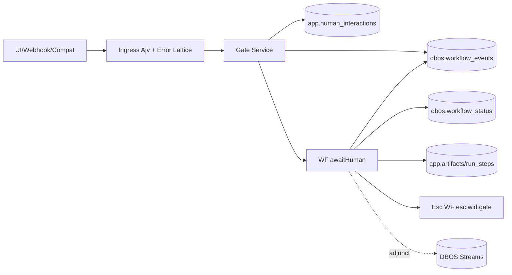

# ADR-008: HITL Gates Lawbook (Cycle-8)

Status: Accepted (GO)  
Date: 2026-02-22  
Scope: `spec-0/00-learnings.jsonl` + `spec-0/08-htn.jsonl` + `spec-0/08/*.jsonl` + `spec-0/08-tasks.jsonl` + `spec-0/08-tutorial.jsonl`

## 1) Problem
Need HITL that is: deterministic, fail-closed, SQL-provable exactly-once, topology-parity (Next/manual/shim), restart-safe, load-safe. Prior “DONE” was false-positive until defect cycle closed S0/S1 gaps.

## 2) Decision (hard)
Adopt HITL as **data ABI + SQL ledger + bounded APIs**, not UI convention:
- Identity: product run `workflowID=intentId`; gate identity `gateKey`; escalation identity `esc:<wid>:<gate>`.
- ABI freeze: keys `ui:<g>|ui:<g>:result|decision:<g>|ui:<g>:audit`; topics `human:<g>|sys:<k>`.
- Primitive-only WF: `send/recv`, `setEvent/getEvent`, `write/read/closeStream`.
- Contract kernel: strict Ajv (`additionalProperties=false`), boundary order fixed.
- Ingress fail-closed: malformed JSON/schema/policy => `400` + zero writes.
- Exactly-once law: PK/unique + `ON CONFLICT DO NOTHING`; dedupe mismatch => `409`.
- Truth law: SQL (`app.*`,`dbos.workflow_status`,`dbos.workflow_events`) > logs > UI.

## 3) Why this, not alternatives
- Reject retry-as-fix: hides causality; violates provability.
- Reject log-as-proof: non-authoritative under restarts.
- Reject gate-specific endpoints/state-machines: drifts ABI, kills reuse.
- Reject stream-as-truth: stream is adjunct UX channel only.

## 4) Kernel invariants (compressed)
- Priority: contract > det/fail-closed > SQL-xonce > throughput/style.
- WF ctrl-only; ST IO-only; repo SQL-map-only.
- Parent queue=`intentQ`; child fanout=`sbxQ`; class law fixed.
- Partition mode: nonblank `queuePartitionKey` mandatory E2E.
- History append-only (`run_steps`,`artifacts`,`sbx_runs`); projections declare latest-wins.
- Status monotonic: no terminal->nonterminal downgrade (except explicit repair reopen).
- Dedupe finalization only when effect observable/confirmed.
- Origin mandatory/closed enum at contract+SQL boundary.
- Ops control plane exact-six routes only.

## 5) Architecture snapshot


Companion diagram: `docs/adr/008-hitl-gates-lawbook/00-topology.mmd`.

## 6) Cycle map (C0->C7)
- C0 lock ABI/seams/contracts/policy.
- C1 implement `awaitHuman` + restart no-phantom prompt.
- C2 freeze event contract + gate FSM + UI from events only.
- C3 ship minimal gate API (`GET gate`,`POST reply`) + dual-router parity.
- C4 decision-as-data + timeout escalation WF (idempotent).
- C5 streams+receiver unification (same send lane, dedupe).
- C6 chaos proofs (kill4,double/late/parallel) + correctness policies.
- C7 load/burst + ship gate trilogy (`quick/check/full`) + release artifact.

## 7) Defect-cycle closure (opinionated read)
Most important closed failure classes:
1. **Blackhole risk**: ledger-before-send suppressed retriable resend.
2. **Fail-open ingress**: schema/json misrouted to `500`.
3. **Orphan writes**: reply accepted invalid run/gate/topic.
4. **ABI drift**: UI enum `v` vs `vs`; dead decision/audit schemas.
5. **Parity drift**: Next/manual route mismatch.
6. **Silent semantic conflict**: same dedupe key + different payload/topic not `409`.
7. **Harness nondeterminism**: shared SYS DB + appversion/port bleed + queue init omissions.
8. **Load false-fails**: schema-readiness race and weak concurrency envelope.

Full matrix: `docs/adr/008-hitl-gates-lawbook/30-defect-closure-matrix.md`.

## 8) Contracts and wire shapes (canonical)
```ts
Decision = { choice: 'yes'|'no', rationale?: string }
GateReply = { payload: object, dedupeKey: string(1..256) }
GateResult.state in {'RECEIVED','TIMED_OUT'}
GateGetQuery.timeoutS in [0..30]
```

```http
POST /api/runs/:wid/gates/:gate/reply
-> 200 ok | 400 bad json/schema | 404 missing run/gate | 409 dedupe/topic/state mismatch
```

## 9) SQL proof floor (must stay zero)
Use `docs/adr/008-hitl-gates-lawbook/10-sql-oracles.sql`:
- dup `run_steps` by `(run_id,step_id,attempt)`
- dup `artifacts` by `(run_id,step_id,task_key,attempt,idx)`
- dup interactions by `(workflow_id,gate_key,topic,dedupe_key)`
- dup decisions by `(workflow_uuid,key)` where `key like 'decision:%'`
- phantom prompts (`ui:*` non-result/non-audit duplicates)
- escalation dup (`workflow_uuid like 'esc:%'`)

## 10) Operator walkthroughs
Executable playbooks in `docs/adr/008-hitl-gates-lawbook/20-walkthrough.sh`:
- PO lane: create intent -> run -> open gate -> reply -> terminal verify.
- QA lane: malformed JSON/schema/missing target/topic mismatch -> deterministic 4xx + zero writes.
- FDE lane: split topology parity + SQL-first triage.

## 11) Release decision
Current recorded state (`2026-02-21`): GO/SHIP (quick/check/full + load/burst + forced soak PASS).  
Rule remains fail-closed: any gate fail => NO_GO; no retry waiver.

## 12) Consequences
Positive:
- Deterministic HITL semantics survive crash/replay/topology split.
- Evidence is machine-verifiable (SQL+tests), not narrative.
- Defects compound into automation (policy/tests/tasks).

Costs:
- Higher contract rigor and migration discipline.
- More explicit env isolation in CI/harness.
- Throughput tuning must respect DB limits (bounded fan-in/fanout).

## 13) Non-negotiable guardrails (future)
- No new raw `human-event` literal in product paths.
- No dedupe ledger finalization pre-effect.
- No route-level business logic bypassing shared service.
- No grep-only policy probes.
- No destructive SYS reset in parallel DAG lanes.

