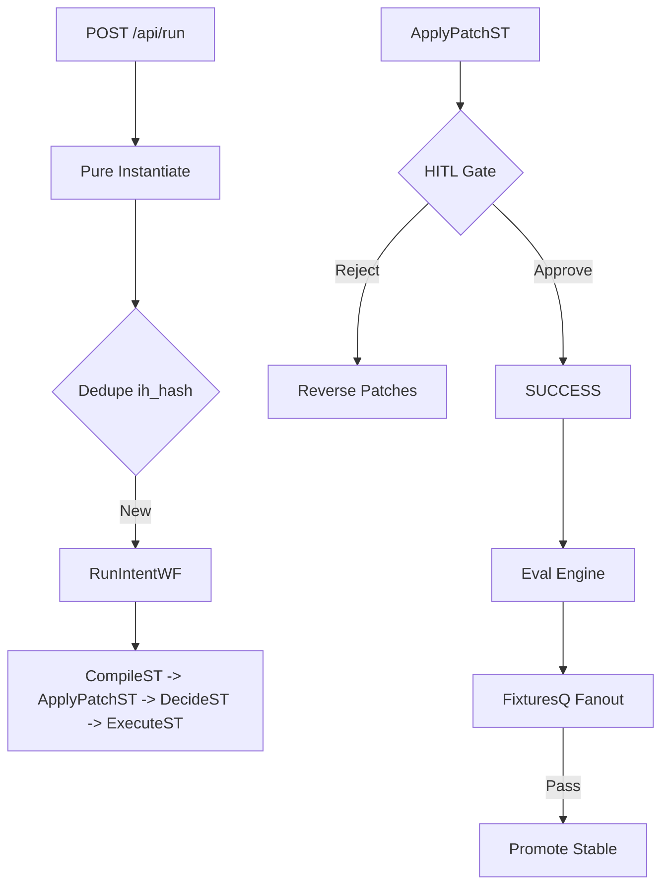

# ADR 009: Data-First Recipe Flywheel

**Status**: IMPLEMENTED / SIGNED-OFF
**Kernel**: RecipeSpec v0 + Hash-Idempotent Run + Autonomous Improvement

## Context
Transition from bespoke, hardcoded workflow branches (e.g., `if (goal.includes('ask'))`) to a deterministic, data-driven execution model. Core problem: per-feature TypeScript edits create drift, break replayability, and prevent autonomous repair. ADR 009 establishes the "Data-First" law: behavior is data, platform is engine.

## Decision
Enforce strict separation between **Platform Logic** (TS) and **Feature Definition** (Recipe JSON).

### 1. RecipeSpec v0 (Immutability Law)
- **Contract**: Strict Ajv surface (`recipe`, `recipe-ref`, `fixture`, `eval-check`, `recipe-bundle`) with `additionalProperties:false`.
- **Storage**: `app.recipes` (mutable pointer `active_v`) + `app.recipe_versions` (append-only, immutable).
- **Promotion**: `draft -> candidate -> stable`. Transition to `stable` is atomic and fail-closed unless coverage floor met (`eval_count>=1 && fixture_count>=1`).
- **Canonical Address**: `sha256(canonicalStringify(json))`.

### 2. Hash-Idempotent Ingress (Identity Law)
- **Path**: `/api/run {recipeRef, formData}`.
- **Compilation**: `intentHash = sha256(canon(instantiateIntent(recipe, formData)))`. Pure function, no IO.
- **Identity**: `workflowID = intentId = ih_<intentHash>`.
- **Dedupe**: DBOS workflow-ID exactly-once. Duplicate submissions converge on the same handle; zero redundant runs.

### 3. Reversible Patch Chain (Durability Law)
- **Step**: `ApplyPatchST` applies a multi-patch plan to the workspace.
- **Guard**: Pre-apply hash check must match `pre_hash`.
- **Reversibility**: On post-apply failure (HITL reject, timeout, or downstream fault), workflow reverse-applies patches to restore exact preimage.
- **Oracle**: Persist `(run, step, patch_idx, path, pre_hash, post_hash, diff_hash)` before apply.

### 4. Autonomous Flywheel (Flywheel Law)
- **Flow**: `Fail -> PostmortemST -> PatchGenST -> HITL Gate -> ApplyPatchST -> Fixtures -> Publish`.
- **Closure**: Improvement is data-only (recipe version bump), never runtime TS change.
- **Policy**: Prohibit adding/editing recipes by modifying platform code.

## Architecture

## Consequences

- **Zero-TS-Edit Velocity**: New features (recipes) are deployed as data assets.
- **Provable Correctness**: Deterministic eval + fixtures block flaky/broken releases.
- **SQL Oracle**: Triage is `app.*` + `dbos.workflow_status/events`. Logs are narrative only.
- **Hermetic Triage**: `repro-pack` exports full intent/run/artifact/eval/DBOS state for offline replay.

## Proof Floor (Mandatory)
- **Edit-set**: `mise run quick` (fmt/lint/type/policy).
- **Pre-merge**: `mise run check` (integration/contract).
- **Signoff**: `mise run full` (e2e/crash/repro).
- **Chaos**: `mise run -f wf:crashdemo` => marks `s1:1,s2:1`.

## Bans (Zero Tolerance)
- No `process.env` mutations outside `src/config.ts`.
- No `Date.now()` or `Math.random()` in dedupe keys or workflow paths.
- No goal-string branching in `run-intent.wf.ts`.
- No publish without fixtures + eval.
