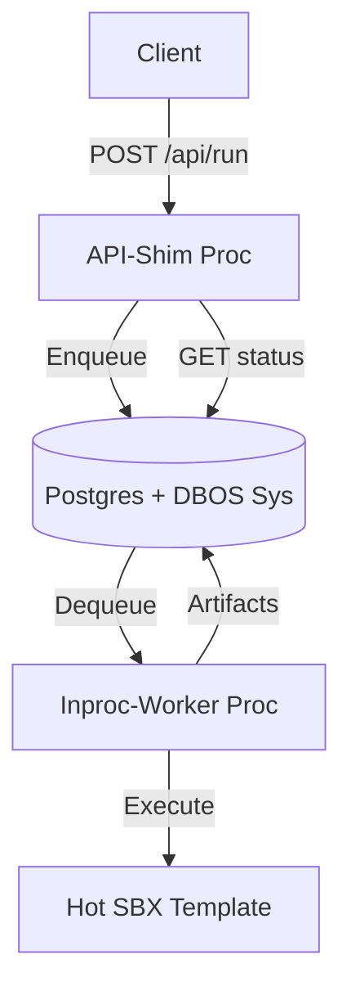

# ADR 010: HTN Prime - Throughput Control Plane

- **Status**: ACCEPTED
- **Kernel**: Contract > Det/Fail-Closed > SQL-xonce > Throughput.
- **Context**: Ship `spec-0/10` throughput program (Split-Topology, Queue Law, Hot SBX, Budgets, CI Load Gates, Batch Ops).

## Decision Kernel

### 1. Split-Topology Boundary (Bet BA)

- **Law**: API Process == Enqueue/Read-Only; Worker Process == Execute-Only.
- **Enforcement**: `WORKFLOW_RUNTIME_MODE` gate in `singleton.ts` bans `DBOS.launch` in API proc.
- **Seam**: `src/workflow/intent-enqueue.ts` is the single edge. No freehand `enqueueOptions`.

### 2. Queue & Flow-Control Law (Bet BB)

- **Hierarchy**: Parent == `intentQ` (interactive/batch lanes), Child == `sbxQ` (fanout).
- **Edge Law**: Every enqueue MUST carry `deduplicationID` OR `priority`. Fail-closed if both absent.
- **Fairness**: Mandatory `queuePartitionKey` propagation end-to-end. Policy probe `policy:queue-partition-propagation` asserts SQL oracle.

### 3. Hot SBX Template Registry (Bet BC)

- **Registry**: Immutable `app.sbx_templates` PK `(recipe_id,recipe_v,deps_hash)`.
- **Selection**: `ExecuteST` resolves template via deterministic key. Drift => Conflict.
- **Proof**: `bootMs` artifact artifact p95 delta (Hot << Cold).

### 4. Backpressure & Budgets (Bet BD)

- **Contract**: Hard budgets (`maxFanout`, `maxSBXMinutes`, etc.) at ingress.
- **Enforcement**: Pure `workflow/budget-guard` seam (No IO). WF clock via DBOS seam only.
- **Outcome**: Deterministic `BUDGET` artifact before terminal status. No silent drops.

### 5. CI as Throttle (Bet BE)

- **Gate**: k6 suites (`smoke`,`ramp`) are first-class merge gates.
- **Oracle**: SQL view `app.v_ops_queue_depth` from system DB pool.
- **Monotonicity**: `quick < check < full`. Any red => `NO_GO`.

## Topology Diagram



## Enqueue Seam (Snippet)

```typescript
// src/workflow/intent-enqueue.ts
export async function enqueueIntentRun(engine: Engine, wid: string, opt: RunOptions) {
  const eo = {
    deduplicationID: opt.dedupeKey,
    priority: opt.lane === "interactive" ? 1 : 1000,
    queuePartitionKey: opt.partitionKey
  };
  if (!eo.deduplicationID && eo.priority === undefined)
    throw new Error("LAW_VIOLATION:DEDUPE_OR_PRIO");
  return engine.startIntentRun(wid, { queueName: "intentQ", ...eo });
}
```

## Proof Floor (Walkthrough)

1. **Bootstrap**: `mise run db:reset && mise run build`
2. **Start**: Terminal A (Worker), Terminal B (Shim).
3. **Ingress**: `curl /api/run` -> Returns `ih_sha256` ID.
4. **Throttle**: `K6_BAD_FIXTURE=1 mise run perf:k6:smoke` -> Fails CI.
5. **Durable**: `mise run -f wf:crashdemo` -> `SUCCESS` marks `s1:1,s2:1`.
6. **Signoff**: `mise run full` -> Green implies GO.

## Historical Resolved Gaps (Ledger)

- [T102] Run-start drift 409 lattice.
- [T112] Queue knob parity (yaml <-> code).
- [T114] DBOS v4.9.11 send-dedupe workaround (event-ledger).
- [T118] Proof-id isolation (runNonce).
- [T121] Relabeled H3 baseline gaps.

---

_Opinion: If it isn't SQL-provable and deterministic, it's just a log anecdote._
