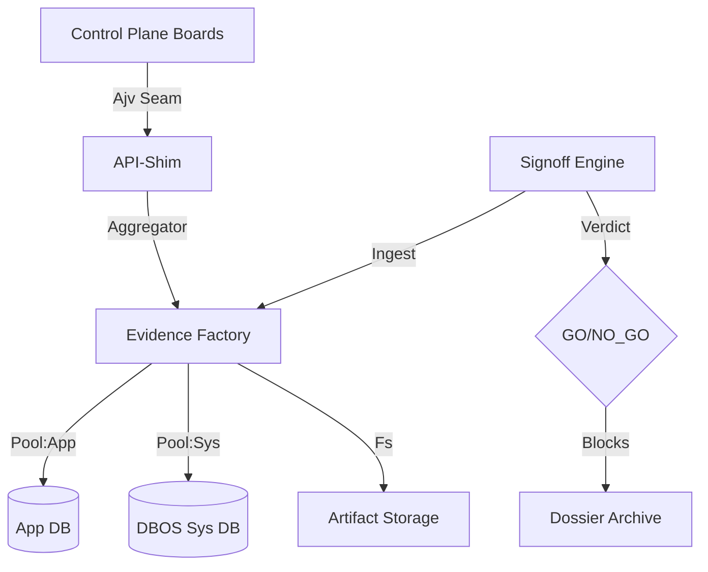

# ADR 011: Operator-First Proof & Signoff Architecture

- **Status**: ACCEPTED
- **Kernel**: Evidence > Signoff > Law > UX.
- **Context**: Ship `spec-0/11` mastery (Run Console, Signoff Board, Binary Verdict, Proof Provenance, Scenario Matrix S00-S15).

## Decision Kernel

### 1. Proof-Grade Evidence (Bet BA)

- **Law**: Evidence != Logs. Every observable claim must carry a semantic `Provenance` tuple: `{source, rawRef, ts, evidenceRefs[]}`.
- **Taxonomy**: Sources are closed-enum: `sql`, `api`, `dbos`, `artifact`, `k6`, `policy`, `test`.
- **Enforcement**: `policy:proof-provenance` is a repo-wide semantic probe that fails CI if mandatory claims lack non-empty evidence refs.

### 2. Binary Signoff Model (Bet BI)

- **Verdict**: Binary `GO/NO_GO`. No amber/stagnant states.
- **Triggers**: Verdict is blocked (NO_GO) if any "Rollback Trigger" is active:
    - **False-Green**: Mandatory GO tile without evidence refs.
    - **Terminal-Divergence**: App status != System status (correlated by `workflow_uuid`).
    - **X1-Drift**: Semantic duplicate side-effects (e.g. `mock_receipts > 1`).
    - **Freshness**: Artifacts not bound to current `commit`/`appVersion`.
- **Audit**: Every `signoff_results` row is immutable and binds to a specific `scenarioId`.

### 3. Seam-Centric Control Plane (Bet BJ)

- **Architecture**: UI "Boards" (Signoff, Throughput, Ops, Recipes) are thin shells.
- **Contracts**: Every board fetch MUST pass through an Ajv-asserted `client-seam`.
- **Lattice**: Errors are mapped to the standard lattice (`400/404/409/500`) + typed `PARSE_ERROR` for contract drift.
- **Copy**: Expert-terse only. ISO timestamps + Relative age. Canonical error strings. No fluff.

### 4. Canonical Run Start Seam (Bet BA)

- **Ingress**: `/api/run` is the single source of truth for execution.
- **Pinned Prowess**: Run launch pins a `recipeRef{id,v}`. Version override paths are blocked when pinned to ensure reproducible execution.
- **Identity**: `workflowID = ih_sha256(canonical(intent))`. Idempotent success on duplicate; 409 on drift.

### 5. Scenario Matrix (Bet BK)

- **S00-S15**: 16 executable proofs mapped to the 011 spec.
- **Oracle**: `scripts/scenario-matrix.ts` generates a byte-stable JSON with real `proofRefs`.
- **Signoff Floor**: Signoff Board GO requires 100% scenario matrix green + proof-labels present.

## Architecture Diagram



## Signoff Model Logic (Snippet)

```typescript
// src/server/signoff-api.ts
export function normalizeSignoffVerdict(board: SignoffBoard): SignoffVerdict {
  const triggers = board.tiles.filter(t => t.triggerActive);
  const falseGreen = board.tiles.some(t => t.mandatory && !t.evidenceRefs?.length);
  
  if (triggers.length > 0 || falseGreen) return "NO_GO";
  return board.tiles.every(t => t.status === "GO") ? "GO" : "NO_GO";
}
```

## Proof Floor (Walkthrough)

1. **Bootstrap**: `mise run quick` -> Verified TSC/Lint.
2. **Execute Matrix**: `mise run check` -> Runs S00-S15 integration + unit.
3. **Inspect Signoff**: Open `tab=signoff`. 
    - Trigger: "Terminal Divergence" -> NO_GO.
    - Evidence: Click `rawRef` for `ih_...` -> Opens Artifact drill-down.
4. **Binary Signoff**: Fix divergence -> All tiles GO -> Large green "GO" verdict.
5. **Dossier**: `K6_RAMP=1 mise run full` -> Green CI -> Archivable Proof.

## Historical Resolved Gaps (Ledger)

- [T40] Spec 11 Closure (16/16 Matrix).
- [T24] Cross-DB join ban (Split Pool).
- [T25] Semantic X1 vs Step-Retry (Logic Flip).
- [T28] Metadata binding (Artifact Freshness).
- [T30] Source-honest copy (`generated_at (service clock)`).
- [T41] Scheduled-WF ID mismatch regression.

---

_Decision: A system is only as good as the proofs it can present under fire._
