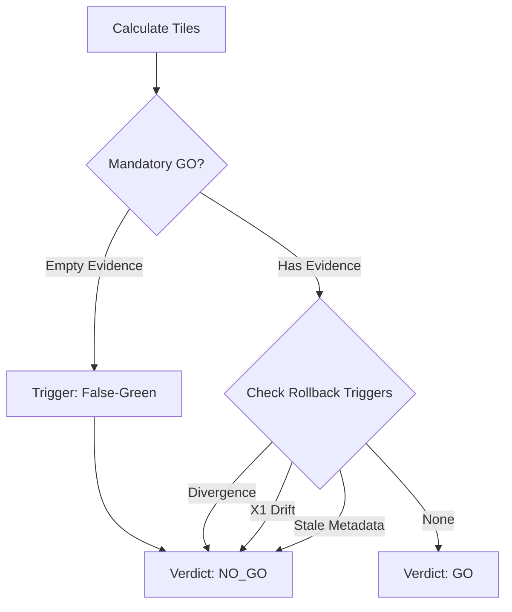

# Signoff Engine & Evidence Lifecycle

This document provides a technical deep-dive into the Signoff Engine implemented in Spec 11.

## 1. Evidence Normalization Pipeline

Evidence is harvested from three distinct layers and normalized into the `ProofCard` contract.

1.  **App Repository**: SQL results from `app.runs`, `app.human_interactions`, `app.patch_history`.
2.  **System Repository**: DBOS `workflow_status` and `workflow_events` (accessed via `sysPool`).
3.  **Artifact Store**: JSON files, K6 summaries, and proof logs in `.tmp/`.

### Provenance Mapping Hierarchy

| Tier     | Source        | ID Key          | Evidence Ref            |
| :------- | :------------ | :-------------- | :---------------------- |
| **SQL**  | `app_db`      | Query Hash      | `app.runs:<wid>`        |
| **API**  | `http_res`    | Route Path      | `POST:/api/run`         |
| **DBOS** | `sys_db`      | `workflow_uuid` | `dbos.wf_status:<uuid>` |
| **X1**   | `side_effect` | PK Tuple        | `app.receipts:0x...`    |

## 2. The Verdict Engine Logic

The verdict is a pure function of the `SignoffBoard` state.



### Core Trigger Predicates

```typescript
// Terminal Divergence
const isDiverged = (appStatus, sysStatus) => isTerminal(appStatus) && !isTerminal(sysStatus);

// Semantic X1
const hasX1Drift = (receiptCount) => receiptCount > 1;

// Metadata Freshness
const isFresh = (artifact) =>
  artifact.commit === currentCommit && artifact.appVersion === currentAppVersion;
```

## 3. UI Control Plane Seams

Every Board (Signoff, Throughput, Ops, etc.) follows the **Seam Pattern**.

```typescript
// src/lib/signoff-client.ts
export async function loadSignoffBoard(): Promise<SignoffBoardResponse> {
  const res = await fetch("/api/ops/signoff");

  // 1. HTTP Layer
  if (!res.ok) throw new Error(`signoff_request_failed:${res.status}`);

  // 2. Format Layer
  const data = await res.json().catch(() => {
    throw new Error("signoff_response_json_parse_failed");
  });

  // 3. Contract Layer (Ajv)
  return assertSignoffBoardResponse(data);
}
```

This prevents the UI from rendering "Zombie Data" or crashing on unhandled response shapes.
