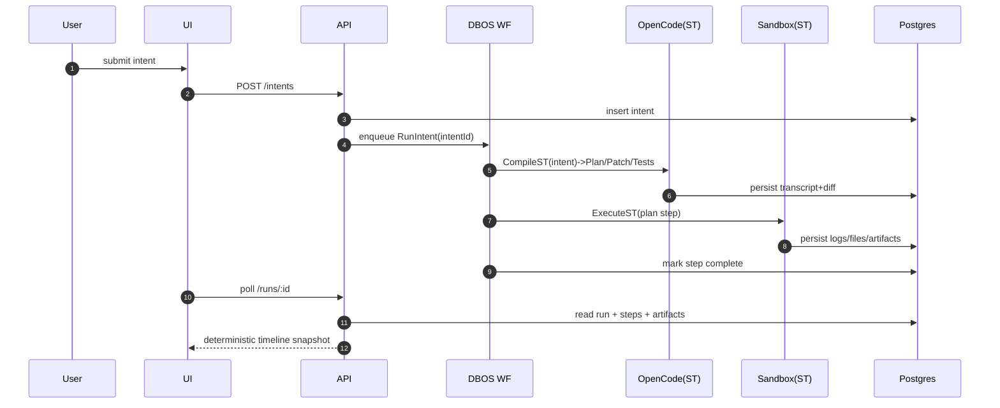
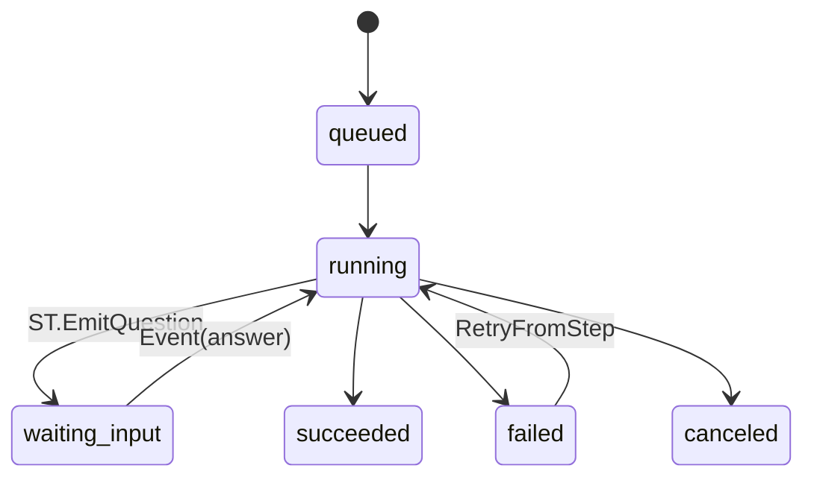

# RFC 000: Workflow-First Agent OS (DBOS x OpenCode x SBX)

- Status: Proposed
- Owner: Core Platform
- Date: 2026-02-17
- Supersedes: none
- Scope: `intent -> durable run -> artifacts`
- Baseline reality: DBOS SDK and OpenCode integrated; durable runs (intents/runs/steps/artifacts) and plan/build split active. (Feb 2026)

## 0. One-line thesis

Compiler, not chatbot: `NL intent -> deterministic workflow spec -> durable execution -> inspectable artifacts -> replayable improvement`.

## 1. Decision (hard yes/no)

Adopt **workflow-first architecture** with these hard binds:

1. Runtime = TypeScript/Node only.
2. Durable state = Postgres only.
3. Orchestration = DBOS only (WF/ST/Q semantics).
4. Codegen+patch = OpenCode server+SDK only.
5. Untrusted/expensive compute = microVM sandbox only (choose one first: Microsandbox OR E2B).
6. Product surface = one page (`Chat + Run + Timeline + Artifacts`).

If any feature bypasses WF/ST artifact trail, reject feature.

## 2. Why now (opinionated)

Current agent products optimize conversation quality; they under-optimize durability, replayability, and provenance. This RFC optimizes for enterprise trust primitive: **"show exact step history, artifacts, retries, and replay deterministically"**.

## 3. Non-goals (explicit)

- No generic "agent platform" abstractions.
- No multi-orchestrator strategy.
- No hidden in-memory business truth.
- No code-first UX for end users.
- No optimistic "best effort" nondeterministic branches.

## 4. Architectural invariant set (fail-closed)

| Invariant     | Rule                                                                                              |
| ------------- | ------------------------------------------------------------------------------------------------- |
| Determinism   | WF code is pure control-flow; all side effects/time/random/net/fs inside ST wrappers only.        |
| Idempotency   | Workflow ID is idempotency key; side-effect tables enforce uniqueness + `ON CONFLICT DO NOTHING`. |
| Durability    | Recovery derives from DB rows, never logs.                                                        |
| Async model   | Background/parallel work uses DBOS queues + handles, never ad-hoc threads.                        |
| API behavior  | JSON-only, explicit status codes, schema-validated boundaries.                                    |
| Observability | WF/ST trace IDs persisted and linked in timeline.                                                 |
| Human loop    | Wait/resume is first-class state transition, not ad-hoc polling hack.                             |

## 5. System model (5 persistent nouns)

```txt
Intent(goal, inputs, constraints, connectors)
WorkflowSpec(nodes, edges, guards, budgets)
Run(run_id, workflow_id, status, trace_id)
Artifact(run_id, step_id, type, uri|inline, hash)
Recipe(name, form_schema, intent_template, wf_template_ref, eval_checks, version)
```

## 6. Component topology

```mermaid
flowchart LR
  UI[Web UI\nChat/Timeline/Artifacts] --> API[API service\nJSON + enqueue]
  API --> PG[(Postgres)]
  API --> DBOSC[DBOS Client]
  DBOSC --> WKR[Worker service\nDBOS runtime]
  WKR --> PG
  WKR --> OC[OpenCode server]
  WKR --> SBX[Sandbox provider\nMicrosandbox|E2B]
  WKR --> O11y[OTel exporter]
  O11y --> Trace[Trace backend]
  UI --> API
```

Opinionated split from day-1 of scale phase:

- `api`: accept intents/enqueue/read models.
- `worker`: execute WF/ST/Q only.

## 7. Canonical execution pipeline



## 8. Workflow semantics (contract)

```ts
// Pseudocode contract, not implementation detail
WF RunIntent(intentId):
  intent = ST.LoadIntent(intentId)
  compile = ST.Compile(intent) // strict schema
  ST.ApplyPatch(compile.patch)
  for node in compile.plan.nodes in topo_order:
    if node.kind === "decision":
      choice = ST.Decide(node) // persisted output; branch deterministically after
    else:
      result = ST.ExecuteNode(node)
      ST.PersistArtifacts(result)
  ST.FinalizeRun(status="succeeded")
```

Hard policy:

- Decision != inline branch logic. Decision is explicit persisted ST output.
- Retry semantics are step-scoped; completed steps are not recomputed unless explicitly invalidated by replay policy.

## 9. Data model delta (from current repo)

Current: `app.workflow_runs`, `app.marks` (crash demo).
Target additive schema (minimal):

```sql
CREATE TABLE app.intents (
  id text PRIMARY KEY,
  goal text NOT NULL,
  payload jsonb NOT NULL,
  created_at timestamptz NOT NULL DEFAULT now()
);

CREATE TABLE app.recipes (
  id text PRIMARY KEY,
  version int NOT NULL,
  name text NOT NULL,
  spec jsonb NOT NULL,
  UNIQUE(name, version)
);

CREATE TABLE app.runs (
  id text PRIMARY KEY,
  intent_id text NOT NULL REFERENCES app.intents(id),
  workflow_id text NOT NULL UNIQUE,
  status text NOT NULL,
  trace_id text,
  created_at timestamptz NOT NULL DEFAULT now(),
  updated_at timestamptz NOT NULL DEFAULT now()
);

CREATE TABLE app.run_steps (
  run_id text NOT NULL REFERENCES app.runs(id),
  step_id text NOT NULL,
  phase text NOT NULL,
  output jsonb,
  trace_id text,
  started_at timestamptz,
  finished_at timestamptz,
  PRIMARY KEY (run_id, step_id)
);

CREATE TABLE app.artifacts (
  run_id text NOT NULL REFERENCES app.runs(id),
  step_id text NOT NULL,
  idx int NOT NULL,
  kind text NOT NULL,
  uri text,
  inline jsonb,
  sha256 text NOT NULL,
  created_at timestamptz NOT NULL DEFAULT now(),
  PRIMARY KEY (run_id, step_id, idx)
);

CREATE TABLE app.opencode_calls (
  id text PRIMARY KEY,
  run_id text NOT NULL REFERENCES app.runs(id),
  step_id text NOT NULL,
  request jsonb NOT NULL,
  response jsonb NOT NULL,
  diff jsonb,
  created_at timestamptz NOT NULL DEFAULT now()
);
```

## 10. External API (small, stable)

```http
POST /intents
-> 201 {intentId}

POST /intents/:id/run
-> 202 {runId, workflowId}

GET /runs/:id
-> 200 RunViewModel

POST /runs/:id/events
-> 202 {accepted:true} // human input / approval / resume

POST /runs/:id/retry
-> 202 {newRunId, fromStep}
```

`RunViewModel` must be deterministic key order + explicit enum states:
`queued|running|waiting_input|succeeded|failed|canceled`.

## 11. Queueing + throughput policy

- Queue classes: `compileQ`, `sandboxQ`, `controlQ`.
- Per-recipe caps: `{maxConcurrency,maxSteps,maxSandboxMinutes}` enforced pre-enqueue.
- Fan-out pattern: parent WF enqueues child WFs on `sandboxQ`, joins handles, aggregates artifacts.
- Soak acceptance: `100` parallel sandbox tasks complete with no duplicate side effects.

## 12. Human-in-loop (HITL) contract

State machine:



Rules:

- Question emitted as artifact (`kind=question_card`) with schema for UI form.
- Resume consumes explicit event payload; no free-form chat parsing dependency.
- Timeout path is explicit branch (`timeout_escalation`).

## 13. Reliability envelope

Crash class handling:

- API crash: harmless; run already queued/durable.
- Worker crash during ST: ST re-executes; idempotency keys prevent duplicate effect.
- Worker crash between STs: resume picks next incomplete step from DB/DBOS state.
- OpenCode server down: `CompileST` fails fast; WF transitions `failed` with machine-readable cause.
- Sandbox outage: step retry with bounded backoff; breach budget -> fail with partial artifacts retained.

## 14. Security + isolation posture

- Sandbox default-deny egress except explicitly allowed connectors.
- Artifact hashing (`sha256`) mandatory for tamper evidence.
- Secret flow: store refs, not secret values, in artifacts and transcripts.
- OC prompt/context capture must redact configured secret patterns before persistence.

## 15. Observability contract

Minimum per run:

- IDs: `run_id`, `workflow_id`, `trace_id`.
- Metrics: queue wait, step duration, retry count, sandbox boot latency, artifact bytes.
- Logs: structured JSON, correlation IDs on all API/ST boundaries.

UI requirement: one-click `step -> trace` deep link.

## 16. Delivery plan (mapped to spec cycles, compressed)

1. C0/C1: schema + `RunIntent` + determinism guardrails + enqueue API.
2. C2: OC server service + SDK wrapper + schema-locked compiler step.
3. C3: one SBX provider + runner step + queue fan-out.
4. C4: single-screen UI timeline + artifacts drawer.
5. C5/C6: trace links + retry controls + HITL wait/resume.
6. C7/C8: recipe flywheel + worker split + throughput/budget knobs.

Ship order (MVP): `MP00->MP10->MP20->MP30->MP41->MP70`.

## 17. Operational gates (must pass)

Use repo canon only:

```bash
mise install
mise run quick
mise run check
mise run full
# soak/repeat validation (cache bypass)
mise run -f wf:crashdemo
```

Promotion criteria:

- Determinism tests fail closed on banned entropy APIs outside wrappers.
- Durability proof is DB-verified (`s1=1,s2=1` invariant style), not log grep.
- Contract tests validate JSON shapes for Intent/Plan/Patch/RunViewModel.

## 18. Alternatives rejected

- Temporal/StepFunctions orchestration: rejected for stack sprawl + local dev friction relative to DBOS+PG minimalism.
- Chat-only UX without timeline: rejected; no provenance, weak trust.
- Multi-sandbox from day 1: rejected; dual adapters increase failure surface before product-market proof.

## 19. Kill criteria (when to stop/reshape)

- If deterministic replay cannot be demonstrated for top-5 recipes.
- If p95 sandbox startup + queue latency makes UX non-interactive for routine runs.
- If recipe completion quality does not improve with postmortem loop after N iterations.

## 20. Appendices

- Walkthrough pack: `docs/rfcs/000-workflow-first-agent-os/walkthroughs.md`
- Interface contracts: `docs/rfcs/000-workflow-first-agent-os/contracts.md`
- Risk register: `docs/rfcs/000-workflow-first-agent-os/risk-register.md`

## 21. Decision mantra

If a claim cannot be answered with `step record + artifact + trace link + deterministic replay path`, it is not production-ready.
